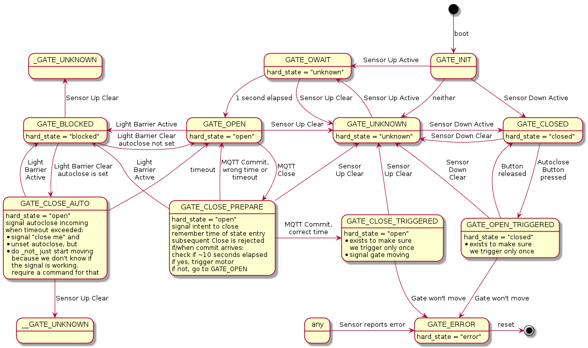

# GateControl

ESP8266 firmware that implements a garage gate controller.

# Physical setup

You'll need:

* a garage gate equipped with a motor
* one sensor each at the top and bottom end positions to locate the gate
* a light barrier
* WiFi, MQTT
* a signal light with which you warn people before automatically closing the gate.

# Status indication

The controller regularly publishes the current state of the gate on the `ctrl/tor/current_hard_position` MQTT topic. You can (and should) use this information to drive a signal light.

# Remote closing

To command the controller to close the gate:

* send an MQTT message of `CLOSED` to `ctrl/tor/set_hard_position`.
* If the controller accepted the command, it acknowledges by sending `waiting` to the `ctrl/tor/close_ack` topic.
* You should now trigger the signal light to show a warning that indicates clearly that the gate is about to move.
* 10 seconds (± some wiggle room) after you sent the initial `CLOSED` command, send `COMMIT` to `ctrl/tor/set_hard_position`.
* If the controller is satisfied with your timing, it replies with `commit` on `ctrl/tor/close_ack`.
* The controller triggers the gate to start moving and sends `closing` on `ctrl/tor/close_ack`.

This scheme basically implements [two-phase commit](https://en.wikipedia.org/wiki/Two-phase_commit_protocol). It is meant to ensure that when individual components fail (like the signal light being unavailable or the orchestrator being rebooted), the gate does not start moving unexpectedly.

# Autoclosing

When you want to leave the garage, having to close the gate manually can be a nuisance. Thus the controller supports autoclose, through a separate physical button connected to one of the inputs. The controller then monitors the light barrier, and if it was clear for a while, automatically closes the gate. Again, using the status indications published on `ctrl/tor/autoclose` to drive a signal light is highly encouraged.

# State Machine

# Disclaimer

I broke my gate once during this project, and it's somewhat probable that so will you. I'm obviously not liable for any damages you cause using this project.
