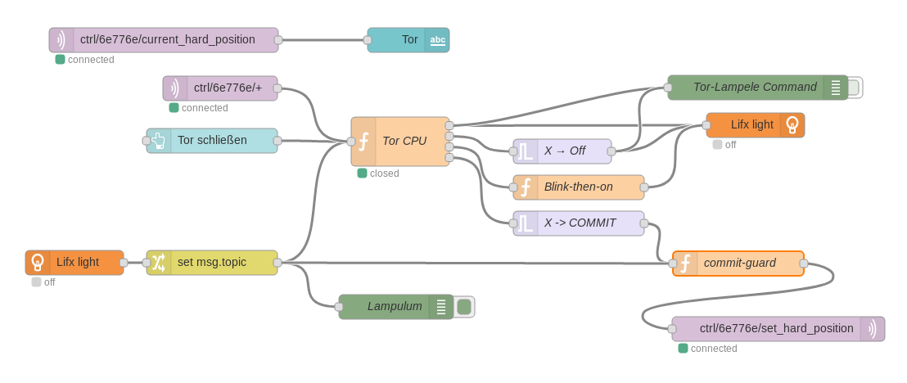
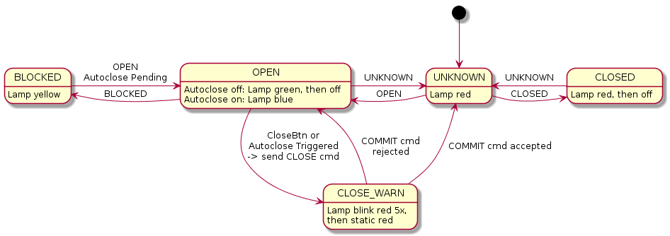

# GateControl

ESP8266 firmware that implements a garage gate controller.

# NodeRED

For GUI and for controlling the signal light, I use NodeRED. Here's the flow:

The main part of the setup is [the CPU node](nodered/cpu.js). Its state machine can be admired here:

# Controller State Machine

# Autoclosing

When you want to leave the garage, having to close the gate manually can be a nuisance. Thus the controller supports autoclose, through a separate physical button connected to one of the inputs. The controller then monitors the light barrier, and if it was clear for a while, automatically closes the gate. Again, using the status indications published on `ctrl/<ChipID>/autoclose` to drive a signal light is highly encouraged.

# Remote closing

To command the controller to close the gate:

* send an MQTT message of `CLOSED` to `ctrl/<ChipID>/set_hard_position`.
* If the controller accepted the command, it acknowledges by sending `waiting` to the `ctrl/<ChipID>/close_ack` topic.
* You should now trigger the signal light to show a warning that indicates clearly that the gate is about to move.
* 10 seconds (± some wiggle room) after you sent the initial `CLOSED` command, send `COMMIT` to `ctrl/<ChipID>/set_hard_position`.
* If the controller is satisfied with your timing, it replies with `commit` on `ctrl/<ChipID>/close_ack`.
* The controller triggers the gate to start moving and sends `closing` on `ctrl/<ChipID>/close_ack`.

This scheme basically implements [two-phase commit](https://en.wikipedia.org/wiki/Two-phase_commit_protocol). It is meant to ensure that when individual components fail (like the signal light being unavailable or the orchestrator being rebooted), the gate does not start moving unexpectedly.

# Status indication

The controller regularly publishes the current state of the gate on the `ctrl/<ChipID>/current_hard_position` MQTT topic. You can (and should) use this information to drive a signal light, or monitor for the `ERROR` state.

# Physical setup

You'll need:

* a garage gate equipped with a motor
* one sensor each at the top and bottom end positions to locate the gate
* a light barrier
* WiFi, MQTT
* a signal light with which you warn people before automatically closing the gate.

# ESP Pinout

Here's how things need to be connected to the ESP. Comments indicate glitches and caveats, most of which are to do with earlier versions of my PCB being less than ideal. I'll probably need to re-do mine so that I can fix these.

All inputs need to be pulled low when they are active, and high otherwise.

| Input                | Pin           | Output       | Comment                            |
| -------------------- | ------------- | ------------ | ---------------------------------- |
| Sensor Monitor       | D0            |              | not yet implemented                |
| Sensor Up            | D1            |              | needs external pull-up             |
| Sensor Down          | D2            |              | needs external pull-up             |
| Autoclose button     | D3            |              | must not be pulled low during boot |
|                      | D4            | Error LED    | ESP on-board LED, LOW = on         |
|                      | D5            | Gate Trigger | HIGH = on                          |
| Lightbarrier blocked | D6            |              |                                    |
| Lightbarrier clear   | D7            |              |                                    |
|                      | D8            | Status LED   | HIGH = on                          |

Note that while it would probably be better to drive the Status LED and the trigger relay by pulling their pins LOW, we can't really do that since that would incur quirky boot behavior. We really do _not_ want the gate to start moving uncontrollably whenever the ESP is reset, and those pins are pulled LOW during boot, so LOW _must_ mean "off".

Also note that I'm thinking about re-using the Status LED to also drive a relay to enable the Light Barrier only when needed. In that case its behavior would change, because blinking would be a really bad idea (or I'd need to debounce that in the hardware, ugh).

# LEDs

* Error LED: Blinks while connecting to WiFi, off while running, static when error
* Status LED: Static when autoclose enabled, blinks when about to close

# Disclaimer

I broke my gate once during this project, and it's somewhat probable that so will you. I'm obviously not liable for any damages you cause using this project.
